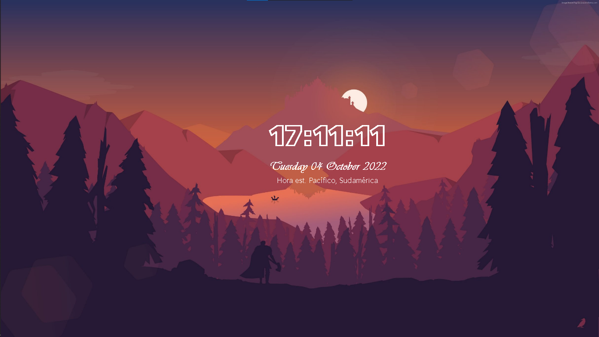

# Clock with Python-tkinter

Project #1 with Python - Tkinter. Clock on desktop screen.

When executing it shows a text with the time
the date and place, as shown to
continuation:

## Grades:
* The background that the image has
   is the desktop background and the
   clock has transparent background.

* Double click and drag on the text
   to move the window.

* One click on the text and then
   press the ESC key to close
   window.

**Best regards !!!**

<cite>Author: Francisco Velez</cite>
